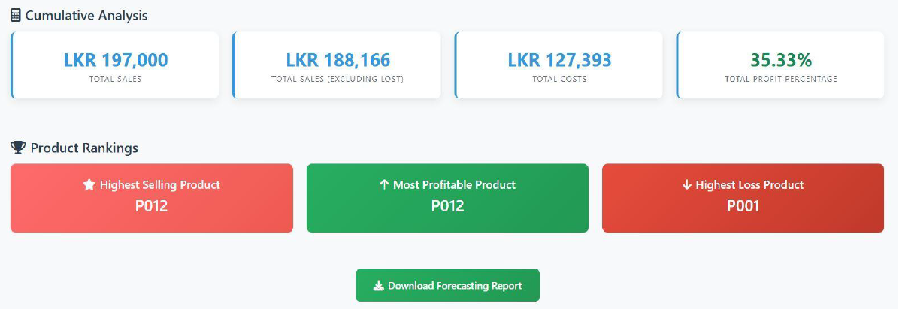
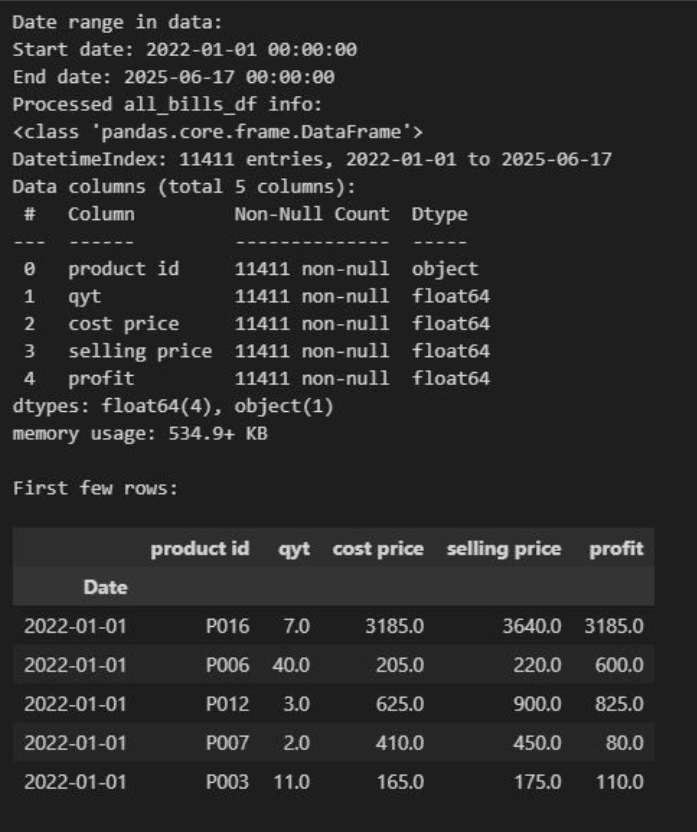

<p align="center">
  
</p>

<h1 align="center">🧠 PredictGuard</h1>
<h3 align="center">Enhancing Sales Forecasting & Loss Prevention for Retail SMEs</h3>

<p align="center">
  
  
  
  
</p>

---

## 📘 Project Overview

**PredictGuard** is a lightweight, cost-effective **decision-support system** designed for **Small and Medium-sized Enterprises (SMEs)** in the Sri Lankan retail sector.  
It integrates an **ARIMA-based forecasting model** with a **Flask-powered BI dashboard** and **automated PDF reporting**, helping retailers tackle issues like:

- Overstocking  
- Stockouts  
- Unmonitored losses  

This project bridges the **technology adoption gap** among SMEs, offering a **localized**, **open-source**, and **affordable** analytics solution that replaces manual, intuition-driven decision-making.

---

## 🔑 Key Features

✨ **ARIMA-Based Forecasting**  
Provides accurate short-term forecasts for:
- Total Sales  
- Total Profit  
- Total Loss  

📊 **Predictive BI Dashboard**  
Interactive, web-based interface (Flask) for:
- Forecast visualization  
- Actual vs. Predicted comparison  

💸 **Loss Prevention Analysis**  
Highlights high-loss products and profit-eroding trends to optimize revenue and reduce costs.

🧾 **Automated PDF Reporting**  
Generates concise, well-structured summaries for management review and quick insights.

💡 **Cost-Effective & Localized**  
- 100% open-source libraries  
- Zero licensing costs  
- Seamless integration with SME data (Excel/CSV)

---

## 🖼️ Screenshots

<p align="center">
  
  <br>
  <em>Reports</em>
</p>

<p align="center">
  
  <br>
  <em>Reports</em>
</p>


---

## 💻 Technical Stack

| **Component** | **Technology / Library** | **Purpose** |
|----------------|--------------------------|--------------|
| **Programming Language** | Python 3.10+ | Rich data science ecosystem |
| **Forecasting Model** | `statsmodels (ARIMA)` | Time-series forecasting |
| **Data Handling** | `pandas`, `numpy`, `openpyxl` | Data cleaning & aggregation |
| **Web Dashboard** | `Flask` | Lightweight BI dashboard |
| **Reporting** | `FPDF` | Automated PDF report generation |
| **Visualization** | `matplotlib` | Graphs & chart generation |

---

## 📊 Methodology and Results

### 🧩 Development Phases
1. **Problem Identification** – Interviews and surveys with SME stakeholders  
2. **Data Collection** – POS data from a Sri Lankan hardware store *(Jan 2022 – May 2025)*  
3. **System Design & Development** – ARIMA model, BI dashboard, PDF reporting  
4. **Testing & Validation** – Unit, System, and UAT with retail personnel  
5. **Evaluation & Refinement** – Accuracy and usability assessment  

### 📈 Key Findings & Accuracy
- **Accuracy Goal:** MAPE ≤ 10%  
- **Achieved Average MAPE:** 8.4% ✅  

| Metric | MAPE (%) |
|--------|-----------|
| Total Sales | 8.5 |
| Total Profit | 7.9 |
| Total Loss | 9.2 |

🧠 **User Satisfaction:**  
92% average satisfaction (ease of use, clarity, and visual design).

---

## 🚀 Future Research Directions

1. **Hybrid Forecasting Models** – Combine ARIMA + LSTM/Prophet for better accuracy  
2. **Real-Time Data Integration** – Direct API-based POS data sync  
3. **AI-Driven Loss Prevention** – Anomaly detection for fraud & stock mismanagement  
4. **Cloud Deployment** – Multi-store aggregation & mobile-friendly access  

---

### 🚀 Development Process

1. 🍴 **Fork the Repository**

    ```bash
    git clone https://github.com/indrachapanbandara/PredictGuard.git
    cd PredictGuard
    ```

2. 🌿 **Install Dependencies & Usage**

    ```bash
    pip install -r requirements.txt
    ```

3. 💻 **Run the Application**
    - python app/run.py
4. ✅ **Access the Dashboard**

    http://127.0.0.1:5000/

5. 📝 **Generate Forecasts**

   Upload your POS data (Excel or CSV format)

   Select the product ID and date range

   View forecast trends in the dashboard

   Click “Download Forecast Report” to export a PDF summary


---

### 📋 Development Guidelines

- **Code Style:** Follow existing patterns and ESLint rules
- **Commits:** Use [conventional commit messages](https://www.conventionalcommits.org/)
- **Documentation:** Update README and inline docs
- **Testing:** Verify functionality before submitting

---

## 🏆 Developers

| [](https://github.com/indrachapanbandara)
|:---:|:---:|
| [Chapa](https://github.com/indrachapanbandara)) | 
